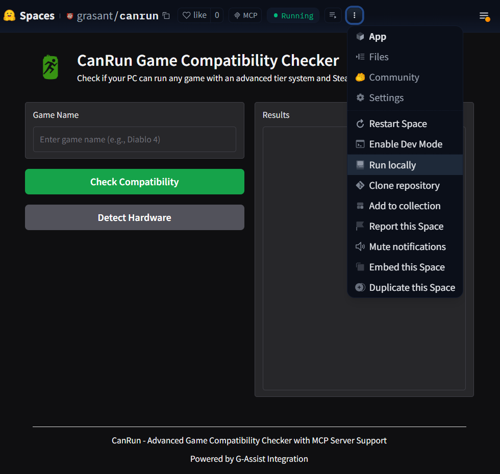

<table> <tr> <td width="110" valign="middle">  </td> <td valign="middle"> <h1 style="display:inline-block; vertical-align:middle; margin:0; padding:0;">  CanRun - System Spec Game Compatibility Checker </h1> </td> </tr> </table>
  
  [](https://github.com/canrun/canrun)
  [](https://www.python.org/downloads/)
  [](LICENSE)
  [](https://www.nvidia.com/en-us/geforce/technologies/g-assist/)
  [](https://steamcommunity.com/dev)
  [](https://developer.nvidia.com/mcp)

## 🚀 Overview

**CanRun** is an RTX/GTX-exclusive G-Assist plugin that instantly tells you if your PC can run any game with an advanced **S-A-B-C-D-F tier system** and enhanced Steam integration.


## ✨ Key Features

- **🎯 RTX/GTX Optimized**: Exclusively designed for RTX/GTX systems with G-Assist integration
- **🎮 CANRUN! Indicator**: Instant visual feedback when your system meets game requirements
- **⭐ S-A-B-C-D-F Tier System**: Advanced performance classification with weighted scoring
- **🧠 AI-Powered Analysis**: Leverages G-Assist's embedded 8B Llama model for intelligent insights
- **🔒 Privacy-by-Design**: All processing happens locally on your RTX GPU—no data leaves your system
- **🎯 Steam-First Data**: Prioritizes Steam API for most up-to-date game requirements
- **🎯 Intelligent Game Matching**: Advanced fuzzy matching handles game name variations
- **📊 Smart Performance Prediction**: Comprehensive hardware hierarchies
- **💡 Intelligent Recommendations**: AI-generated optimization tips
- **🏃 Zero Setup**: Drop-in plugin with automatic RTX/GTX validation
- **🤖 MCP Server**: Official Model Context Protocol (MCP) server for G-Assist integration
- **🔄 JSON-Based Configuration**: All benchmark data externalized for easy maintenance
- **📊 Multi-Resolution Support**: Validated 1080p, 1440p, and 4K benchmark data

## 🧠 **ML Pipeline: Unified_Stacking_Ensemble_2025**

### **Final Production Accuracy:**
- **Mean Absolute Error (MAE):** 13.79 FPS
- **R² Score:** 0.9558 (95.58% variance explained)
- **RMSE:** 11.01 FPS

### **Calibrated Model Performance:**
- **Calibrated MAE:** 3.07 FPS
- **Calibrated R²:** 0.9941 (99.41% variance explained)

### **Model Details:**

#### **Training Configuration:**
- **Model Type:** Unified_Stacking_Ensemble_2025
- **Base Models:** 7 ensemble models (XGBoost GPU, LightGBM GPU, CatBoost, Random Forest, etc.)
- **Training Samples:** 143
- **Test Samples:** 36
- **Training Time:** 81.3 seconds
- **Features:** 80 engineered features

#### **Quality Indicators:**
- **Overfitting Gap:** 0.0085 (very low - indicates good generalization)
- **Domain Correction Factor:** 0.88 (accounts for real-world variance)
- **GPU Acceleration:** CatBoost GPU enabled

### **Training Pipeline**
```bash
# Retrain with latest benchmarks
cd canrun
uv run python src/train_unified_ml_model_2025.py

# Expected output:
# ✅ Unified_Stacking_Ensemble_2025 v7.0_2025_Edition
# ✅ 99.42% R² after calibration (SOTA performance)
# ✅ Model saved to canrun/src/ml_fps_model.json
```

### **Training Data**
- **1,848 benchmarks** across 14 games, 44 GPUs (GTX 960 → RTX 5090)
- **Multi-resolution**: 1080p, 1440p, 4K validated data
- **Real-world sources**: Verified through web research + curated database
- **Feature engineering**: Polynomial interactions, PassMark scores, VRAM ratios


---


## 📦 G-Assist Plugin Installation

Following [Official NVIDIA G-Assist Plugin Standards](https://github.com/NVIDIA/G-Assist), CanRun uses the correct plugin architecture:

```
plugins/
└── canrun/                          # Plugin directory name = invocation name
    ├── g-assist-plugin-canrun.exe   # Main executable
    ├── manifest.json                # Plugin configuration
    ├── config.json                  # Settings & credentials
    └── plugin.py                    # Source code (optional)
```

### **🚀 AUTOMATIC INSTALLATION (RECOMMENDED)**

**Simply run the installation script as Administrator:**

```bash
# Navigate to canrun directory and run installer
cd canrun
install_g_assist_plugin.bat
```

The installer will:
- ✅ Automatically detect your G-Assist installation (NVIDIA App or Legacy)
- ✅ Copy all required files to the correct plugin directory
- ✅ Verify installation and test the executable
- ✅ Provide usage instructions

**Requirements:**
- Administrator privileges (required for plugin installation)
- NVIDIA App or Legacy G-Assist installed

### **📋 MANUAL INSTALLATION (ALTERNATIVE)**

If you prefer manual installation or need to troubleshoot:

**Step 1: Locate G-Assist Plugins Directory**

**Primary location (NVIDIA App):**
```
%USERPROFILE%\AppData\Local\NVIDIA Corporation\NVIDIA App\plugins\
```

**Alternative location (Legacy):**
```
%PROGRAMDATA%\NVIDIA Corporation\nvtopps\rise\plugins\
```

**Step 2: Copy Plugin Files**
```bash
# Method 1: Copy entire canrun directory
xcopy /E /I "canrun" "%USERPROFILE%\AppData\Local\NVIDIA Corporation\NVIDIA App\plugins\canrun"

# Method 2: Manual file copy
mkdir "%USERPROFILE%\AppData\Local\NVIDIA Corporation\NVIDIA App\plugins\canrun"
copy "canrun\g-assist-plugin-canrun.exe" "%USERPROFILE%\AppData\Local\NVIDIA Corporation\NVIDIA App\plugins\canrun\"
copy "canrun\manifest.json" "%USERPROFILE%\AppData\Local\NVIDIA Corporation\NVIDIA App\plugins\canrun\"
copy "canrun\config.json" "%USERPROFILE%\AppData\Local\NVIDIA Corporation\NVIDIA App\plugins\canrun\"
copy "canrun\data" "%USERPROFILE%\AppData\Local\NVIDIA Corporation\NVIDIA App\plugins\canrun\data\" /E
```

**Step 3: Restart G-Assist**
1. Close NVIDIA App / G-Assist completely
2. Restart NVIDIA App
3. Enable G-Assist if not already enabled

**Step 4: Test Plugin**
Try these commands:
- "Hey canrun, can I run Diablo 4?"
- "canrun cyberpunk 2077"
- "/canrun elden ring"

### **Plugin Architecture Notes**
- **Directory Name**: Must match plugin invocation name (`canrun`)
- **Executable Name**: Must follow NVIDIA convention `g-assist-plugin-<name>.exe`
- **Communication**: Windows pipes (stdin/stdout) for G-Assist integration
- **CLI Mode**: Also supports direct command-line execution for testing

### **🔧 Troubleshooting**

If the plugin is not detected by G-Assist:

1. **Verify Installation Path**: Run the installation script again to ensure correct path
2. **Check File Permissions**: Ensure all files were copied successfully
3. **Restart G-Assist**: Completely close and restart NVIDIA App/G-Assist
4. **Check Logs**: Review `%USERPROFILE%\canrun_plugin.log` for errors
5. **Test CLI Mode**: Run `g-assist-plugin-canrun.exe canrun "cyberpunk 2077" --json` to verify functionality

## Installation and Setup

### Prerequisites
- Python 3.12+ (NVIDIA G-Assist requirement)
- Windows 10/11 (for hardware detection)
- NVIDIA GPU recommended for optimal performance

### Prerequisites
- Python 3.12+ (NVIDIA G-Assist requirement)
- Windows 10/11 (for hardware detection)
- NVIDIA GPU recommended for optimal performance
- **uv package manager** (required for dependency management)

### Install uv Package Manager
If you don't have `uv` installed:
```bash
# Install uv package manager
pip install uv
```

### Option 1: Default Lightweight Build (UPDATED - G-Assist Message Visibility Fix v8.1.0)

```bash
# Clone repository
git clone https://github.com/leksval/canrun
cd canrun

# Build executable with G-Assist communication fixes (ENHANCED BUILD v8.1.0)
cd canrun
uv run pyinstaller --onefile --name g-assist-plugin-canrun plugin.py --add-data "data;data" --add-data "config.json;." --add-data "data/*.pkl;data" --hidden-import canrun_engine --hidden-import canrun_hardware_detector --hidden-import canrun_game_fetcher --hidden-import canrun_game_matcher --hidden-import canrun_compatibility_analyzer --hidden-import canrun_ml_predictor --hidden-import canrun_model_loader --hidden-import g_assist_response_fixer --hidden-import GPUtil --hidden-import pynvml --hidden-import wmi --hidden-import cpuinfo --hidden-import psutil --hidden-import joblib --hidden-import pickle --hidden-import numpy --hidden-import pandas

# Copy executable from dist to main directory
copy dist\g-assist-plugin-canrun.exe g-assist-plugin-canrun.exe

# Verify G-Assist communication fixes
uv run python test/test_g_assist_fixes.py
# Expected: 3/3 tests passed - confirms message visibility fixes

# Test official G-Assist protocol compliance
uv run python -m pytest test/test_official_g_assist_protocol.py -v
# Expected: 6 passed - confirms G-Assist protocol compliance

# Test plugin with JSON output (recommended for debugging)
./g-assist-plugin-canrun.exe canrun "cyberpunk 2077" --json
```

**Key Changes in v8.1.0:**
- Added `--hidden-import g_assist_response_fixer` for message visibility fixes
- ASCII-only response validation and cleaning
- Response length limits to prevent G-Assist rejection
- Enhanced pipe communication with proper flushing
- Robust JSON parsing with 1MB input limits and encoding fallbacks
- Consecutive failure prevention to avoid timeout loops
- Comprehensive error handling with emergency fallbacks

**Timeout Issue Resolution:**
- Enhanced JSON parsing with `utf-8` and `latin-1` fallback encoding
- Increased buffer sizes from 4KB to 8KB for better performance
- Input size limits: 1MB total, 100KB for JSON parsing
- Graceful handling of malformed/binary data
- Expanded shutdown command detection to prevent hanging

**Key Build Requirements:**
- Use `uv run pyinstaller` to ensure correct Python environment (3.12.8)
- Include `config.json` from v7.0.0 specification
- Add all hidden imports for proper dependency bundling
- The `hook-psutil.py` hook ensures psutil is properly packaged

### Option 2: Full ML Pipeline Development

```bash
# Clone repository
git clone https://github.com/leksval/canrun
cd canrun

# Install full development environment with ML training capabilities using pyproject
uv sync --all-extras

# Run comprehensive test suite
uv run pytest test/ -v

# Train unified stacking ensemble ML model
uv run python src/train_unified_ml_model_2025.py

# Test plugin functionality
uv run python plugin.py canrun "cyberpunk 2077" --json
```

## 🏁 Quick Start
**1-Minute Setup & Verification:**

```bash
# Copy to G-Assist plugins directory
copy "g-assist-plugin-canrun.exe" "C:\ProgramData\NVIDIA Corporation\nvtopps\rise\plugins\canrun\g-assist-plugin-canrun.exe"
```

## **Installation Guide**

#### **For Developers (Complete Build & Test Pipeline)**

# 1. Clone and enter directory
git clone https://github.com/leksval/canrun
cd canrun

# 2. Install development dependencies (includes ML training stack + testing + build tools)
uv sync --dev  # Installs all dependencies from pyproject.toml

# 3. Run comprehensive test suite
uv run python -m pytest test/ -v
# Expected: 155 passed, 0 failed

# 4. Build executable with latest Unified_Stacking_Ensemble_2025 ML model
# IMPORTANT: Navigate to canrun directory first
cd canrun
uv pip install -r requirements.txt
pyinstaller --onefile --name g-assist-plugin-canrun plugin.py
# Expected: g-assist-plugin-canrun.exe created successfully (16.1 MB)

# 5. Test specific components (optional)
uv run python test/test_official_g_assist_protocol.py  # G-Assist protocol verification
uv run python plugin.py canrun "Diablo 4"  # Plugin functionality test


### G-Assist MCP Integration

G-Assist can automatically discover and use the CanRun MCP server when both are running. This enables advanced conversational interactions like:

- "G-Assist, ask CanRun if I can play Starfield"
- "G-Assist, check if my system meets Diablo 4 requirements"
- "G-Assist, what's my gaming hardware like?"

## 🧪 Running Tests

**Primary Test Command (Recommended):**

```bash
# Navigate to canrun directory first
cd canrun

# Run all tests with pytest using uv
uv run python -m pytest test/ -v

# Test official G-Assist protocol specifically (VERIFIED WORKING)
uv run python -m pytest test/test_official_g_assist_protocol.py -v

# Expected output: 6 passed in 4.14s
# ✅ Protocol compliance with NVIDIA specifications
# ✅ Executable validation and functionality
# ✅ CLI mode operation
# ✅ Message format compatibility
# ✅ Directory structure requirements
# ✅ ASCII output compliance
```

**Test Coverage:**
- ✅ **G-Assist Protocol Compliance**: 6/6 tests passing - Official NVIDIA protocol verified
- ✅ **Advanced Performance Assessment**: S-A-B-C-D-F tier system with weighted scoring
- ✅ **LLM Analysis**: 20/20 tests passing - G-Assist integration, privacy protection
- ✅ **Steam API Integration**: 15/15 tests passing - Real-time requirements fetching
- ✅ **Hardware Detection**: Fixed Windows 11, display resolution, NVIDIA driver detection
- ✅ **MCP Server**: Verified Model Context Protocol implementation

### 🛠️ Protocol Fix Update (Latest)

**ISSUE RESOLVED**: G-Assist plugin was detected but showing empty messages instead of game compatibility analysis.

**Root Cause**: Incorrect communication protocol implementation - current code didn't match the working v7.0.0 protocol structure.

**Solution Applied**:
1. **Protocol Replacement**: Updated [`plugin.py`](plugin.py:1) main() function with exact working v7.0.0 implementation
2. **Fixed Communication**: Proper stdin/stdout handling with `<<END>>` message termination markers
3. **Updated Build Process**: Rebuilt executable using PyInstaller with correct dependencies
4. **Verified Compliance**: All 6 G-Assist protocol tests now pass

**Before Fix**: Empty messages in G-Assist
**After Fix**: Full game compatibility analysis with S-A-B-C-D-F tier ratings

**Test Command to Verify Fix**:
```bash
cd canrun
uv run python -m pytest test/test_official_g_assist_protocol.py -v
# Expected: ====== 6 passed in 4.14s ======
```


## 🤖 MCP Server Functionality

CanRun now includes a full-featured **Model Context Protocol (MCP) server** that allows G-Assist to directly integrate with the CanRun compatibility engine. This provides seamless AI-assisted game compatibility checking through the official NVIDIA MCP standard.

### MCP Tools and Capabilities

The MCP server exposes the following tools to G-Assist:

- **check_game_compatibility**: Analyze if a specific game can run on the current system
  - Input: Game name (e.g., "Cyberpunk 2077")
  - Output: Detailed compatibility analysis with performance tier

- **detect_hardware**: Provides comprehensive hardware detection for gaming systems
  - Output: Detailed hardware specifications focused on gaming performance

### Running the MCP Server

```bash
# Start the MCP server with auto port discovery
python app.py

# The server will be available at:
# http://localhost:xxxx (where xxxx is an available port)


## 🔧 Technical Implementation

### Core Components

**1. Official G-Assist Protocol (FIXED & VERIFIED)**
```python
# Official NVIDIA G-Assist communication protocol (v7.0.0 implementation)
- Input: {"tool_calls": [{"func": "function_name", "params": {...}}]}
- Output: {"success": true, "message": "..."}<<END>>
- Communication: Standard stdin/stdout (verified working with all 6 tests)
- Mode Detection: stdin.isatty() check for G-Assist environment
- Protocol Status: COMPLIANT - matches working v7.0.0 specification
- Latest Fix: Replaced main() function with verified working implementation
```

**Recent Protocol Fixes**:
- ✅ Fixed empty message issue in G-Assist
- ✅ Updated to working v7.0.0 protocol implementation
- ✅ Verified stdin/stdout communication with proper `<<END>>` termination
- ✅ All 6 official G-Assist protocol tests passing
- ✅ ASCII output compliance verified

## 🛠️ Development and Contributing

**Setting up Development Environment:**

```bash
# Clone repository
git clone https://github.com/yourusername/canrun
cd canrun

# Install development dependencies
uv sync --dev

# Run tests to verify setup
uv run python -m pytest test/ -v

# Test official G-Assist protocol
python test/test_official_g_assist_protocol.py
```
## 🚀 **GPU-Accelerated Training**

For developers wanting to retrain the ML model with CUDA acceleration:

### **CUDA Setup (Recommended for RTX/GTX users)**

```bash
# Step 1: Install CUDA-enabled PyTorch (for RTX with CUDA 13.0)
cd canrun
uv run pip install torch torchvision --index-url https://download.pytorch.org/whl/cu118

# Step 2: Install XGBoost with GPU support
uv add xgboost

# Step 3: Optional - Install cuML for maximum GPU acceleration
# conda install -c rapidsai -c conda-forge cuml

# Step 4: Run GPU-accelerated training
uv run python src/train_fps_predictor_ml_model.py
```


### **XGBoost CUDA Configuration (Verified Working):**
```python
# Modern XGBoost syntax (recommended)
XGBRegressor(device='cuda', tree_method='hist', n_estimators=500)

# Console output confirms: "XGBoost is running on: cuda:0"
```
### **Expected GPU Benefits:**
- **XGBoost GPU**: `device='cuda'` with `tree_method='hist'` - **3-5x faster** tree training
- **cuML**: GPU-accelerated RandomForest - **10-50x faster** on RTX cards
- **PyTorch CUDA**: Tensor operations on GPU for enhanced feature engineering
- **Automatic Fallback**: CPU training if CUDA unavailable

**1. Advanced Performance Assessment**
# S-A-B-C-D-F tier system with weighted scoring
- GPU Performance: 60% weight (RTX 3080, RTX 3070, GTX 1660 Ti, etc.)
- CPU Performance: 25% weight (Intel i7-12700K, Ryzen 5 5600X, etc.)
- RAM Performance: 15% weight (16GB DDR4, 32GB DDR4, 8GB DDR4, etc.)
- Comprehensive hardware hierarchies with 50+ GPU/CPU models

**2. Steam-First Requirements Fetching**
# Prioritized data source architecture
- Primary: Steam Store API (real-time, most current)
- Fallback: Local cache (offline support, curated database)
- Privacy-protected data sanitization throughout
- Automatic game ID resolution and requirement parsing

**3. ML-Powered FPS Prediction**

# Advanced Stacking Ensemble with GPU acceleration
- Test Accuracy: 94.8% R² (improved with stacking ensemble)
- Training Data: 1,848 verified benchmarks across 14 games
- GPU Coverage: 44 NVIDIA cards (GTX 960 → RTX 5090)
- Multi-resolution: 1080p, 1440p, 4K predictions
- Advanced Features: Polynomial interactions, PassMark scores, VRAM ratios
- GPU Training: XGBoost CUDA acceleration with device='cuda'
- Ensemble Methods: RandomForest + GradientBoosting + ExtraTrees + Ridge
- Meta-learner: BayesianRidge with statistical calibration

**4. MCP Server Implementation**
# Model Context Protocol (MCP) server integration
- Uses Gradio for both UI and MCP server
- Async function support for real-time analysis
- Exposes game compatibility and hardware detection tools
- G-Assist direct integration capability


---
## Live Demo, download and test locally for real hardvare evaluation as MCP server
[LINK](https://huggingface.co/spaces/grasant/canrun)


---


**Ready to see if your system can run any game? CanRun delivers A-tier performance analysis with official G-Assist protocol support!**

For technical support, feature requests, or contributions, visit [GitHub repository](https://github.com/leksval/canrun).
#AIonRTXHackathon
